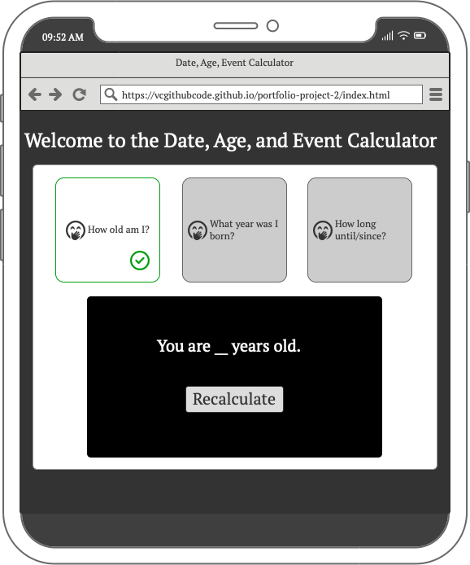
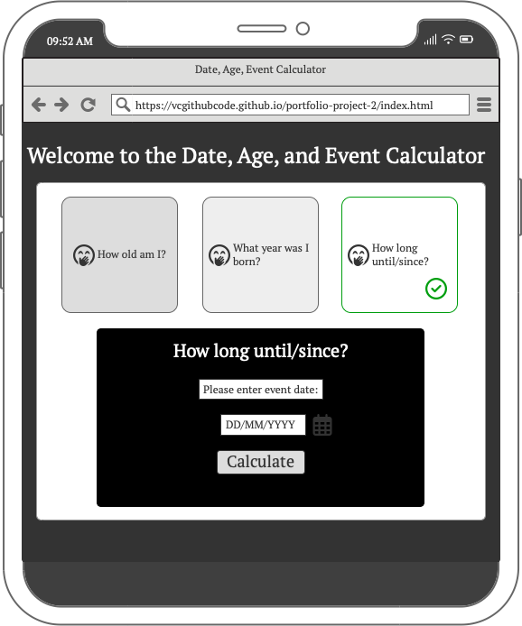

# The Date, Age, and Birth year Calculator

The Date, Age, and Birth Year Calculator is a simple and straightforward web app for anyone wanting to quickly determine an age, birth year, or the difference between two dates.

This tool aims to be a resource for those seeking answers to these questions without the complexity or clutter often found in other online options.

[Click here to take a look at the Live Webapp](https://vcgithubcode.github.io/portfolio-project-2/)

# Author

- [@VCGithubCode](https://www.github.com/VCGithubCode)

# User Experience

## Target Audience

- Users looking to recall their own age or figure out the age of someone else quickly using their birth date

- Users looking to recall their own birth year or the birth year of someone else using their age

- Users looking to quickly calculate the difference between two dates

## User Stories

### As a user I want to:

1. Figure out how to quickly calculate an age

2. Calculate a birth year from how many years old a person is

3. Find the difference in days between two dates

# Design Choices

This web app was designed with simplicity as a priority. There are no unnecessary distractions, allowing the user to focus on their main task. The typical radio buttons have been replaced with larger, more prominent buttons that clearly present the available options. Additionally, the display below each selection provides users with a second chance to ensure they are answering the correct question, making navigation through the single-page app intuitive and straightforward.

Users receive immediate and clear feedback to confirm their input has been received.

## Wire frames

Several wire frames were created to help keep focused during the development

## Color

A color palette was chosen that matched the background image representing the natural passage of time.  The idea was that a high level of contrast would make the app more accessible.

## Typography

The typography style that was chosen was meant to be easy to read without being too pensive.  The font size was increased a bit depending on where the messages appeared in the layout for ease on the eyes, but without overpowering the main focus of the app. Some text shadow was added to give the text a style mirroring the hourglass in the background image.  The Google fonts, Quicksand and Prompt, were used based on pairings from [Fontjoy.com](https://fontjoy.com/).

# Features

* ## Favicon

The calendar emoji was chosen as a simple and clear representation of dates.

* ## Header

A simple title Header was created to give users a clear and immediate understanding of what the app is about at a glance.

* ## Instructions

A "Show Instructions" button that activates a modal window which gives further instruction about how the app is to be used was provided for user support.

* ## Calculator Options

The user is presented with three radio buttons that allows them to choose which date calculation they would like to perform by either clicking or using the tab and enter keys.  The typical radio buttons were converted into three selection boxes, allowing the user to more easily select and identify their choice.  The question contained in the selection box also matches the calculator display.

* ## Calculator Display

Depending on which option the user selects, they will presented with an input field for their date of birth and be provided with their age when they select the calculate button...

...or the year they were born in when they provide their age in years...

...or the difference in days between two dates when they provide two dates.

* ## Recalculate button

After the initial calculation has been performed, the user is presented with a recalculate button in case they want to reenter new data and perform the respective calculation again without having to refresh the page or reselect the same option.

* ## Footer

The footer contains remarks on the main purpose of the project for now.

* ## 404 Error Page

If a user navigates to an invalid URL, they will be directed to the 404 error page. This page informs them of the error and provides a button to return to the main web app.

* ## Back to Home Button

This button provides a way for the user to return to the main web app if they are directed to the 404 error page.

