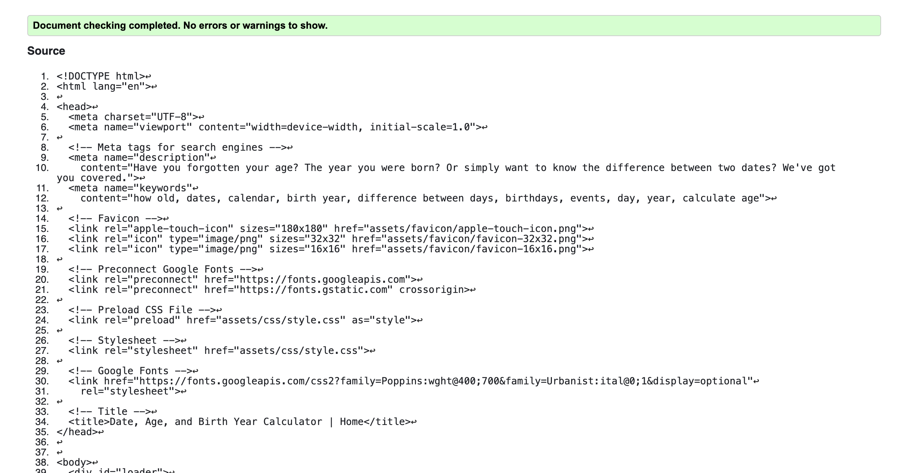

# The Date, Age, and Birth Year Calculator

The Date, Age, and Birth Year Calculator is a simple and straightforward web app for anyone wanting to quickly determine an age, birth year, or the difference between two dates.

This tool aims to be a resource for those seeking answers to these questions without the complexity or clutter often found in other online options.

[Click here to take a look at the Live Webapp](https://vcgithubcode.github.io/portfolio-project-2/)

# Author

- [@VCGithubCode](https://www.github.com/VCGithubCode)

# User Experience

## Target Audience

- Users looking to recall their own age or figure out the age of someone else quickly using their birth date

- Users looking to recall their own birth year or the birth year of someone else using their age

- Users looking to quickly calculate the difference between two dates

## User Stories

### As a user I want to:

1. Figure out how to quickly calculate an age

2. Calculate a birth year from how many years old a person is

3. Find the difference in days between two dates

# Design Choices

This web app was designed with simplicity as a priority. There are no unnecessary distractions, allowing the user to focus on their main task. The typical radio buttons have been replaced with larger, more prominent buttons that clearly present the available options. Additionally, the display below each selection provides users with a second chance to ensure they are answering the correct question, making navigation through the single-page app intuitive and straightforward.

Users receive immediate and clear feedback to confirm their input has been received.

## Wire frames

Several wire frames were created to help keep focused during the development

## Color

A color palette was chosen that matched the background image representing the natural passage of time.  The idea was that a high level of contrast would make the app more accessible.

## Typography

The typography that was ultimately chosen was meant to be easy to read without being too pensive.  The font size was increased a bit depending on where the messages appeared in the layout for ease on the eyes, but without overpowering the main focus of the app. Some text shadow was added to give the text a style mirroring the hourglass in the background image.

# Features

* ## Favicon

The calendar emoji was chosen as a simple and clear representation of dates.

* ## Loader

[Loader](assets/images/Loader.mov)

* ## Header

A simple title Header was created to give users a clear and immediate understanding of what the app is about at a glance.

* ## Instructions

A "Show Instructions" button that activates a modal window which gives further instruction about how the app is to be used was provided for user support.

* ## Calculator Options

The user is presented with three radio buttons that allows them to choose which date calculation they would like to perform by either clicking or using the tab and enter keys.  The typical radio buttons were converted into three selection boxes, allowing the user to more easily select and identify their choice.  The question contained in the selection box also matches the calculator display.

* ## Calculator Display

Depending on which option the user selects, they will presented with an input field for their date of birth and be provided with their age when they select the calculate button...

...or the year they were born in when they provide their age in years...

...or the difference in days between two dates when they provide two dates.

* ## Error Handling

An error for those times when a user doesn't enter a date of birth and attempts to calculate their age.

An error for those times when a user chooses a future date for their date of birth.

An error for those other times when the user claims to be a time traveler.

An error for those times when the user claims to have discovered the fountain of youth.

An error for those times when the user does not enter a first date.

* ## Recalculate button

After the initial calculation has been performed, the user is presented with a recalculate button in case they want to reenter new data and perform the respective calculation again without having to refresh the page or reselect the same option.

* ## Footer

The footer contains remarks on the main purpose of the project for now.

* ## 404 Error Page

If a user navigates to an invalid URL, they will be directed to the 404 error page. This page informs them of the error and provides a button to return to the main web app.

* ## Back to Home Button

This button provides a way for the user to return to the main web app if they are directed to the 404 error page.

## Future Features

- [ ] Add a Clock widget so users can see their local time

- [ ] Add a Calendar widget that imports holidays and allows users to mark special dates

- [ ] Add the ability for users to save a personal calendar

- [ ] Add the ability for users to see special events, international days, and holidays by clicking on the date of the calendar

# Testing

  - [HTML](#html)
  - [CSS](#css)
  - [JavaScript](#javascript)
  - [Manual Testing](#manual-testing)
  
## Validator Testing

### Home

- index.html

- 404.html

No errors or contrast errors found

### HTML

#### Home

No errors found

#### Error 404

No errors found

### CSS

  - style.css

No errors found

### Javascript

  - script.js

No errors found

## Lighthouse

### Home

### Error

## Manual Testing

| **Feature** | **Test performed** | **Expected Outcome** | **Pass/Fail** |
| :-----: | :-----: | :-----: | :-----: |
| Loader |Refreshed page |Loader displays until page is ready | PASS |
| Header Link | Clicked on Header Link |Redirected to Home Page| PASS |
| Show Instructions | Clicked Show Instructions Button | Instructions Modal Opens | PASS
Close Modal X | Clicked the "X" to close the Modal | Modal Closes | PASS |
| Close Modal Outside Window | Clicked Outside Modal Window | Modal Closes | PASS |
| Close Modal Window on Mobile Devices Outside Window | Tapped Outside Modal Window | Modal Closes | PASS |
| Calculator Selection Buttons | Tapped/Clicked on Radio Button | Button Feedback and Correct Calculator Displays | PASS |
| Date Field | Tapped/Clicked on Date Field | Able to input data into field | PASS |
Calculate Button | Tapped/Clicked on Calculate Button | Received appropriate feedback | PASS |
Recalculate Button | Tapped/Clicked on Recalculate Button | Resets the original state of calculator |PASS |
| Footer Icon Link | Tapped/Clicked on Icon Link | Opens up Github Repo in new window | PASS
Back to Home Button | Tapped/Clicked on Home Button (Error page) | Returns to Home page | PASS |

## Responsive Testing

Several physical Devices were used to test responsiveness

- Samsung Galaxy S8+
- Samsung Galaxy 22 Ultra +
- Iphone 10 XS Max
- Iphone 12 Pro Max
- Dell 9310 Laptop 13 inch
- Macbook Pro M2 16 inch

Several Virtual Devices were also used inside of Google Chrome Dev tools to emulate these devices in Landscape and Portrait mode

Different Browsers were also inspected for layout and performance variants including

- Google Chrome
- Firefox
- Safari
- Microsoft Edge
- Brave Browser

## Bugs Found

Problem: In some of the browsers, the close button of the modal would appear on the left side instead of the right.

Solution: The css was adjusted to position the close button on the left of all devices fixed in place for a more consistent experience.

Problem:  On some of the smaller devices below 600px in height the page could not scroll down to the bottom.

Solution: Adjust overflow so that each device could adopt the flexibility to display the entire page.

Problem: In some of the browsers, the background image was not visible.

Solution: Adjust media breakpoints and styles so that most of the devices breakpoints were caught in between media queries.  Add a fallback image for compatibility on each media query so the browser can determine the best option.

Problem: On some mobile devices the footer was covered by a white line at the bottom of the screen.

Solution: Add padding to the footer so to give room for the device function.

# Deployment and Local Development

## Deployment

The site is deployed to GitHub Pages - [Here](https://vcgithubcode.github.io/portfolio-project-2/index.html)

To Deploy the site using GitHub Pages by following these steps:

1. Login (or signup) to Github.
2. Go to the repository for this project, [Date, Age, and Event Calculator](https://vcgithubcode.github.io/portfolio-project-2/index.html).
3. Click the settings button.
4. Select pages in the left hand navigation menu.
5. From the source dropdown select main branch and press save.
6. The site has now been deployed, please note that this process may take a few minutes before the site goes live.

## Local Development

### How to Fork

To fork this repository:

1. Log in (or sign up) to Github.
2. Go to the repository for this project, [Date, Age, and Event Calculator](https://vcgithubcode.github.io/portfolio-project-2/index.html)
3. Click the Fork button in the top right corner.

### How to Clone

To clone this repository:

1. Log into your account on Github
2. Go to the repository of this project, [Date, Age, and Event Calculator](https://vcgithubcode.github.io/portfolio-project-2/index.html)
3. Click on the code button, and copy your preferred clone link.
4. Open the terminal in your code editor and change the current working directory to the location you want to use for the cloned directory.
5. Type 'git clone' into the terminal, paste in the link you copied in step 3 and press enter.

# Credits

### Icon
The Github Icon was sourced from [uxwing.com](https://uxwing.com/github-white-icon/)

### Images
The background image on the index page was sourced from [Freepik.com](https://www.freepik.com/)

<a href="https://www.freepik.com/free-photo/same-hourglass-now-more-prominent-with-its-shadow-marks-fleeting-moments_135010356.htm#fromView=search&page=1&position=49&uuid=cade1bd7-0d6a-489c-ae8f-5594d750796a">Image by rorozoa on Freepik</a>

The background image on the 404.html page was created with the help of [Leonardo.ai](https://leonardo.ai/)

### Coding Inspiration and assitance

- The code used was a combination of a few bits and pieces from the Love Maths content in the Code Institute LMS, [MDN web docs](https://developer.mozilla.org/en-US/docs/Web/JavaScript), [Stack Overflow](https://stackoverflow.com/questions/44667161/page-moving-left-and-right-while-in-mobile-browser)
- I also used [W3Schools](https://www.w3schools.com/jsref/jsref_obj_date.asp) for ideas on the Date object and loader javascript
- For help with the media queries, I attempted to use ChatGPT, Github Co-pilot, Google Dev tools AI, and ever Cursor as an assistant, but found no clear answers to achieve my goals.
- For inspiration for the apperance of the loader I used this entry on UIVerse.com by [doniaskima](https://uiverse.io/doniaskima/rare-falcon-68)

### Content
- The text content on the website is written by me.

### Acknowledgements
- I would like to thank my mentor, [Daisy Mc Girr](https://github.com/Dee-McG) for her guidance, encouragement, and support throughout this project and the course.

